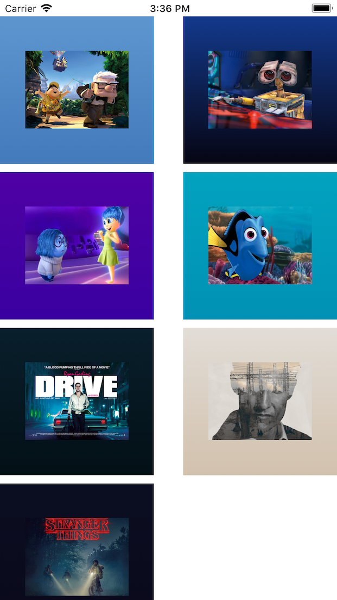

# Grade Swift

Generate gradient from the 2 main dominant colours in an image. This a port of [grade](https://github.com/benhowdle89/grade) in Swift for iOS.



## Setup

As cocoapods/carthage support is not available yet, simply include the `Source/Grade.swift` file in your project.

## Usage

```swift
// iOS
let image = UIImage(named: "myimage")!
let (start, end) = GradeColors(forImage: image)
```

An sample project is available inside the `Sample-iOS` directory.